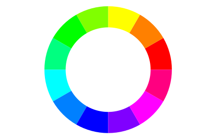
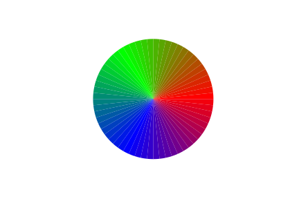

<!DOCTYPE html>
<html>
<h3>V1.2.1 Hexadecimal Additions</h3>
    
    
    
Re-examining code and better optimizing methods.
    
    
    
<h3>V.1.0.1 A better wheel</h3>

Essentially what I wanted to create with this repository, but I might try to take things further if more ideas come.

    
<h3>V.1.0 Python Added</h3>

Implemented the color wheel in matplotlib python library. Still looking to add more color definiton to the wheel. 

</html>     

